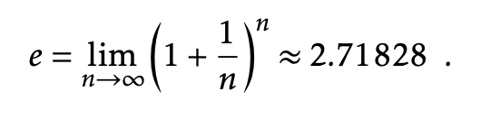

## The need for efficiency

* Number of operations
* Processor speeds
* Bigger data sets

## Interfaces

An `interface` sometimes also called an `abstract data type`, defines the
set of operations supported by a data structure and the semantics,
or meaning, of those operations.

### Queue

* `add(x)`: add a value to the queue (a.k.a enqueue, push)
* `remove()`: remove the next value from the queue and return it. (a.k.a. dequeue, shift)

FIFO (first-in-first-out) removes items in the same order they were added.

A priority Queue always removes the smallest element from the Queue, breaking ties arbitrarily.
`remove()` is sometimes called `deleteMin()`.

### Stack

LIFO (last-in-first-out) the most recently added element is the next one removed.

* `add(x)`: add a value to the queue (a.k.a enqueue, push)
* `remove()`: `pop()` the item at the top of the stack.

### Deque

Is a generalization of both the FIFO Queue and the LIFO Queue (stack).
A deque represents a sequence of elements, with a front and a back.

### List

Represents a sequence, x0,...,xn-1, of values.

* `size()`: return the length of the list.
* `get(i)`: return the value xi
* `set(i, x)`: set the value of xi to equal to x
* `add(i, x)`: add x at position i, displacing xi,...,xn-1;
* `remove(i)`: remove the value xi displacing xi+1,...,xn-1;

The operations can be implemented with a Deque interface.

* `addFirst(x)` -> `add(0, x)`
* `removeFirst()` -> `remove(0)`
* `addLast(x)` -> `add(size(), x)`
* `removeLast()` -> `remove(size() - 1)`

### USet

The `USet` interface represents an unordered set of unique elements, which
mimics a mathematical set. A `USet` contains `n` distinct elements; no
element appears more than once; the elements are in no specific order. A
`USet` supports the following operations:

* `size()`: return the number, `n`, of elements in the set.
* `add(x)`: add the element `x` to the set if not already present;
* `remove(x)`: remove `x` from the set;
* `find(x)`: find `x` in the set if it exists

### SSet

The `SSet` interface represents a sorted set of elements. An `SSet` stores elements
from some total order so that any two elements x and y can be compared. In code
examples, this will be done with a method called `compare(x, y)` in which:

* < 0 if x < y
* > 0 if x > y
* = 0 if x == y

An `SSet` supports the `size()` and `add()` and `remove()` methods with
exactly the same semantics as in the `USet` interface. The difference
between a `USet` and an `SSet` is in the `find(x)` method:

> successor search: locate x in the sorted set;
> find the small element y in the set such that y >= x.
> return y or null if no such element exists.


The extra functionality provided by a SSet usually comes with a price that
includes both a larger running time and a higher implementation complexity.
SSet implementations may have a `find(x)` running time of of logarithmic
and a USet may have a running time of constant time.


## Math Review

### Exponentials and Logarithms

The expression b^x denotes the number `b` raised to the power of `x`.

* when x is negative, b^x = 1/(b^-x)
* when x is 0, b^x = 1


```text
b^x = b * b * ... x b
      |____________|
            |
         x times
```

```ruby
b ** x = (x.times.inject(1) { |m, _| m * b }
```

```irb
irb(main):001:0> 2 ** 10
=> 1024
irb(main):002:0> 10.times.inject(1) { |m, _| m * 2 }
=> 1024
```

log b(k) deontes base-b logarithm of k. i.e b^x = k

```text
  log b(k) == b^x = k
```

```ruby
irb(main):016:0> 2 ** 10
=> 1024
irb(main):017:0> Math.log2(1024)
=> 10.0
```

An informal way to think about logarithms is to think of logb(k) as the number
of times we have to divide k by b before the result is less than or equal to 1.

For example, when one does binary search, each comparison reduces the number of
possible answers by a factor of 2. This is repeated until there is at most one
possible answer. Therefore the number of comparisons done by binary search when there
are initially at most n + 1 possible answers is at most log2(n+1).

Another logarithm that comes up several times in this book is the natural logarithm.
Here we use the notation ln k to denote log e(k), where e -- Euler's constant -- is given by:



The natural logarithm comes up frequently because it is the value of a particularly common integral.

### Factorials

> n!: pronounced n factorial. `n! = 1 * 2 * 3 ... n`

* 0! is defined as 1

```ruby
irb(main):001:0> class Integer
irb(main):002:1>   def !
irb(main):003:2>     (1..self).inject(:*)
irb(main):004:2>   end
irb(main):005:1> end
=> :!
irb(main):006:0> !2
=> 2
irb(main):007:0> !3
=> 6
irb(main):008:0> 2.!
=> 2
irb(main):009:0> 3.!
=> 6
```

#### binomial coefficient

* `(n/k)` pronounced "n choose k".
* counts the number of subsets of an `n` element set that have size `k`.

i.e. the number of ways of choosing k distinct integers from the set {1,...,n}.


### Asymptotic Notation

When analyzing data structures we want to talk about the running times of various operations.
The exact running times will, of course, vary from computer to computer and even from run to run on an individual computer.
When we talk about the running time of an operation we are referring to the number of computer instructions
performed during the operation. Instread of analyzing running times exactly, we will use the so-called
big-Oh notation: For a function `f(n)`, `O(f(n))` denotes a set of functions.


E.g.

```c
void snippet() {
  for (int i = 0; i < n; i++)
    a[i] = i;
}
```

* 1 assignment (int i = 0;
* n + 1 comparisons (i < n)
* n increments (i++)
* n array offset calculations (a[i])
* n indirect assignments (a[i] = i)

We could write thi running time as:

```text
T(n) = a + b(n+1) + c*n + d * n + en,

where a, b, c, d and e are constants that depend on the machine running the code and
represent the time to perform assignments, comparisons, increment operations, array offset calculations,
and indirect assigments, respectively.
```

With big-Oh notation the running time can be simplified to:

```text
T(n) = O(n)
```

## The Model of Computation

To analyze the theoretical running times of operations on data structures we use a
mathematical model of computation. We use the w-bit word-RAM model.

RAM stands for Random Access Machine. In this model we have access to a
random access memory consistenting of cells, each of which stores a w bit `word`.
This implies that a memory cell can represent, for example, any integer in the set {0,...,2^w - 1}.

In the word-RAM model, basic operations on words take constant time. This includes arithmetic operations
`(+, -, *, /, %)`, comparisons `(<, >, =, <=, >=)` and bitwise boolean operations (bitwise AND, OR, and
exclusive-OR).

Any cell can be read or written in constant time. A computer's memory is managed by a memory management
system from which we can allocate or deallocate a block of memory of any size we would like.
Allocating a block of memory of size `k` takes `O(k)` time and returns a reference (a pointer) to
the newly-allocated memory block.

The word-size `w` is a very important parameter of this model. The only assumption we will
make about `w` is that the lower bound `w >= log(n)`, where n is the number of elements stored in
any of our data structures.

Space is measured in words, so that when we talk about the amount of space used by a data structure, we
are referring to the number of words of memory used by the structure. All of our data structures
store values of generic type T, and we assume an element of type T occupies one word of memory.

The w-bit word RAM mode is fairly close match for the 32-bit Java Virtual Machine when w = 32.
The data structures presented in this book don't use any special tricks that are not implementable on the
JVM and most other architectures.


Performance of a data structure

1. Correctness: The data structure should correctly implement its interface.
2. Time complexity: The running times of operations on the data structure should be as small as possible.
3. Space complexity: The data structure should use as little memory as possible.

Running time guarantees:

1. Worst-case running times: These are the strongest kind of running time guarantees. If the worst case is `f(n)` then one operation will never take more than `f(n)` time.
2. Amortized running times: If we say that the amortized running time of an operation in a data structure is `f(n)`, then this means that the cost of a typical operation is `f(n)`.
3. Expected running times: If we say that the expected running time of an operation on a data structure is `f(n)`, this means that the actual running time is a random variable and the expected value of this random variable is at most `f(n)`.

Worst-case versus amortized cost:

Home costs $120,000.00
10 year mortgage with a monthly payment of $1200.00/month.
Worst case monthly payment is $1200.00/month

Buying the house costs $120,000.00. After 10 years, this works out to $1,000.00/month.

Worst-case versus expected cost:

Fire insurance on $120,000.00 home.
Insurance company charges $15.00/month and expects a cost of $10.00/month.
Do we pay the $15.00/month or try to save $10.00/month ourselves. $10.00/month
is less than $15.00/month but the actual cost may be much higher. If the whole
house burns down then it will cost $120,000.00.

## Code Samples

List Implementations

| name | get(i)/set(i, x) | add(i, x) / remove(i) |
| --- | --- | --- |
| ArrayStack | O(1) | O(1 + n - i)^a |
| ArrayDeque | O(1) | O(1 + min {i, n - i})^a |
| DualArrayDeque | O(1) | O(1 + min{i, n-1})^a |
| RootishArrayStack | O(1) | O(1 + n - i)^a |
| DLList | O(1 + min{i, n-1}) | O(1 + min{i,n-1}) |
| SEList | O(1 + min{i, n-1}/b) | O(b + min{i,n-1}/b)^a |
| SkiplistList | O(logn)^e | O(logn)^e |

USet Implementations

| name | find(x) | add(x)/remove(x) |
| --- | --- | --- |
| ChainedHashTable | O(1)^e | O(1)^a,e |
| LinearHashTable | O(1)^e | O(1)^a,e |

SSet Implementations

| name | find(x) | add(x) / remove(x) |
| --- | --- | --- |
| SkiplistSSet | O(logn)^e | O(logn)^e |
| Treap | O(logn)^e | O(logn)^e |
| ScapegoatTree | O(logn) | O(logn)^a |
| RedBlackTree | O(logn) | O(logn) |
| BinaryTrie | O(w) | O(w) |
| XFastTrie | O(logw)^a,e | O(w)^a,e |
| YFastTrie | O(logw)^a,e | O(logw)^a,e |
| BTree | O(logn) | O(B + logn)^a |
| Btree^x | O(logb n) | O(log b n) |

Priority Queue Implementations

| name | findMin() | add(x)/remove() |
| --- | --- | --- |
| BinaryHeap | O(1) | O(logn)^a |
| MeldableHeap | O(1) | O(logn)^e |

